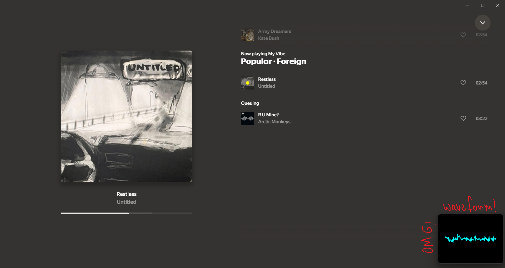

# Audio Visualizer for Windows 11

A lightweight real-time system audio visualizer for Windows 11. This project captures system audio using a C++ loopback capture utility and streams it into a Python-based GUI visualizer.



## Features

* Real-time system audio capture (loopback)
* Smooth waveform visualization
* Always-on-top minimal UI
* Frameless transparent-style window
* Auto-hide when mouse cursor is nearby
* Runs silently in background (no console window)

## Project Structure

```
audiovizer/
├── assets/
│   └── preview.png
├── capture_system_audio.cpp   # C++ audio capture (WASAPI loopback)
├── capture_system_audio.exe   # Compiled executable
├── visualize_audio.py         # Python visualizer (PyQtGraph)
├── start_visualizer.vbs       # Background launcher script
└── README.md
```

## Requirements

### Python

* Python 3.8+
* numpy
* pyqtgraph
* PyQt5 (installed automatically with pyqtgraph in most cases)

Install dependencies:

```
pip install numpy pyqtgraph
```

### Windows

* Windows 10/11
* WASAPI support (default in modern Windows)

## How It Works

1. `capture_system_audio.exe` captures system audio using WASAPI loopback.
2. It outputs raw float samples to `stdout`.
3. The Python script reads this stream via `stdin`.
4. The GUI visualizes the waveform in real time.

Data flow:

```
capture_system_audio.exe → (pipe) → visualize_audio.py
```

## Running the Project

The application is designed to run **only via Windows startup using a VBS script**. This is required because standard shortcuts cannot handle piping between processes.

1. Press `Win + R`
2. Type:

```
shell:startup
```

3. Press Enter — the Startup folder will open.
4. Right-click `start_visualizer.vbs` → **Copy**
5. In the Startup folder → Right-click → **Paste Shortcut**

---

## Behavior

* The visualizer appears as a small overlay window.
* It automatically hides when the mouse cursor is near it.
* Runs silently in the background.

## Notes

* Designed specifically for Windows audio pipeline (WASAPI).
* Minimal CPU usage due to buffered updates.
* GUI updates are throttled for performance.